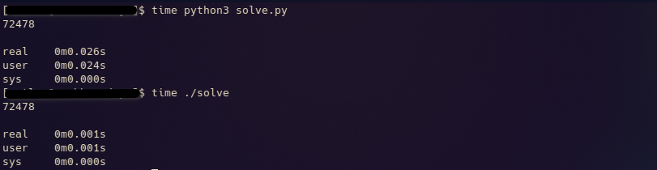

# x86_AdventOfCode2022
It's that time of the year again!  
Only this year I decided to mix things up a bit and take on the advent of code using x86 Assembly.

Why you ask?  
  

Just look at all those nanoseconds saved. Nice.
